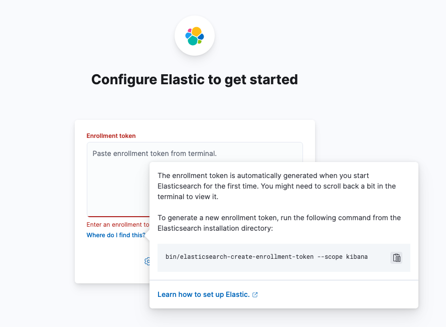
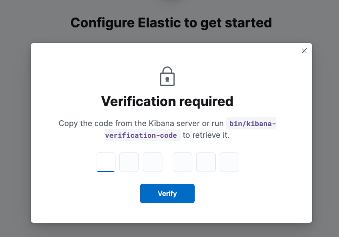

## Setup

```sh
docker-compose up -d
```

Access browser http://127.0.0.1:5601



```sh
# Access elasticsearch container
docker exec -it dev-es8 bash

# generate token
./bin/elasticsearch-create-enrollment-token --scope kibana
WARNING: Owner of file [/usr/share/elasticsearch/config/users] used to be [root], but now is [elasticsearch]
WARNING: Owner of file [/usr/share/elasticsearch/config/users_roles] used to be [root], but now is [elasticsearch]
eyJ2ZXIiOiI4LjEpMyIsImFkciI6WfIxNzIuMTguMC4z1jkyMDAiXSwiZmdy7joiMjgwZ9U4Mzk4NGJlYjcwZmY2NDgyNmZlNGE3NmI4NDlmM2ExNjRmNGVjY2YwYzRmYTE0ZTNkYjQ4NWVjZWI5NiIsImtleSI6IlB2X3dYNEFCdEpCTjA2WVg5Qnl1OjlBQTduUjJWVHBLdUF6RWZkVVA1Z1EifQ==
```



```sh
# access kibana container
docker exec -it dev-kibana8 bash

# generate verification code
./bin/kibana-verification-code
Your verification code is:  597 784
```
